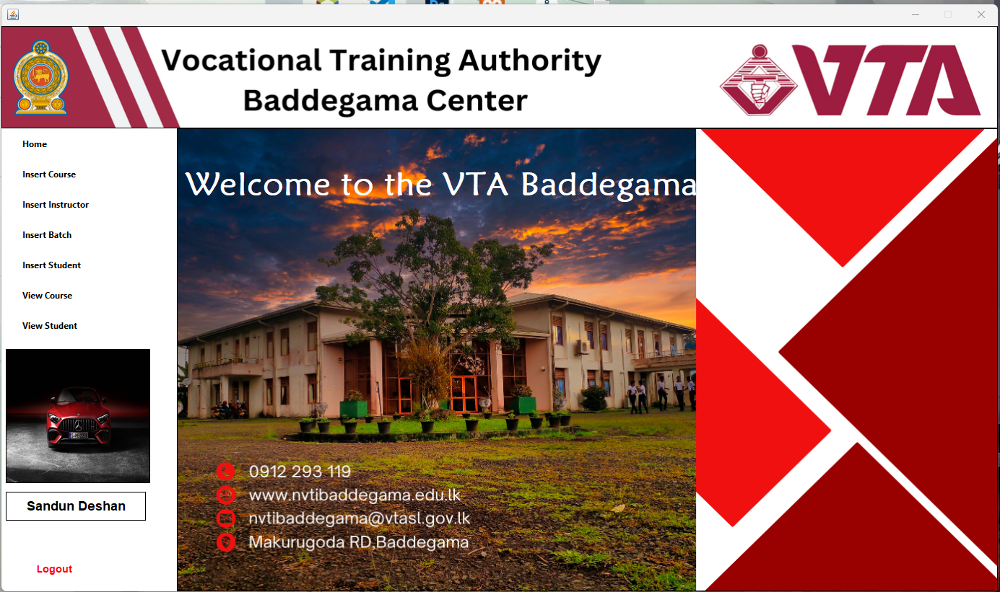
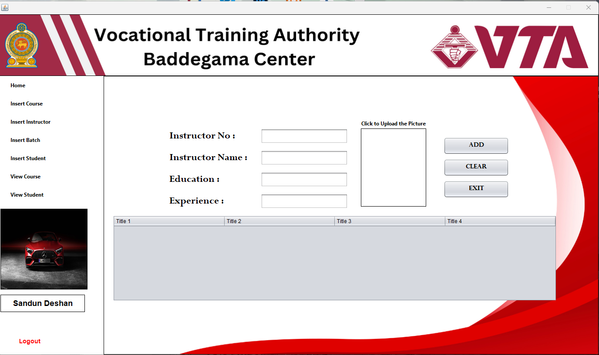
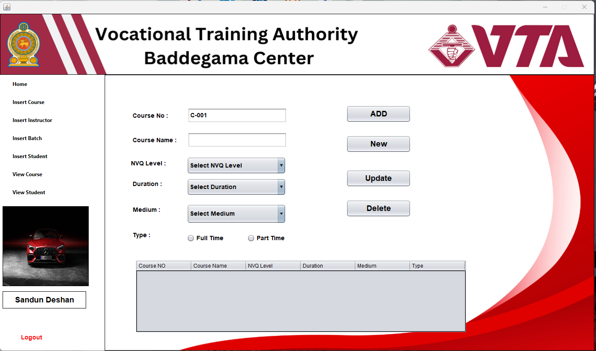
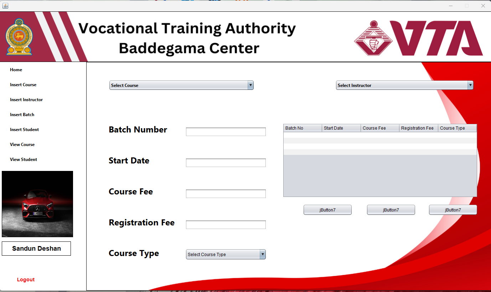

# 📚 Learning Management System (LMS)

📌 **Overview**  
The **Learning Management System (LMS)** is a Java-based application developed using **NetBeans IDE** and **MySQL**. It is designed to streamline the management of students, teachers, and staff within an educational institution. The system provides secure authentication, role-based access, user and course management, fee and salary transactions, and printable bill generation. It is a comprehensive solution for managing educational workflows efficiently.

---

## 🚀 **Features**  
- **User Authentication**: Secure login and registration for students, teachers, and staff.  
- **Image Upload**: Store and retrieve user profile pictures in the database.  
- **Role-Based Access**: Different user roles (Student, Teacher, Staff) with specific privileges.  
- **User Management**: Add, update, delete, and search users.  
- **Course Management**: Manage courses assigned to students and teachers.  
- **Fee & Salary Transactions**: Record student fee payments and teacher/staff salaries.  
- **Print Bill Feature**: Generate and print receipts for transactions.  

---

## 🛠️ **Technologies Used**  
- **Java (NetBeans IDE)**: For backend logic and GUI development.  
- **MySQL**: For database management.  
- **JDBC**: For database connectivity.  

---

## 🔧 **Core Functionalities**  
1. **Multi-Role Login & Registration**: Secure authentication for students, teachers, and staff.  
2. **CRUD Operations**: Perform Insert, Update, Delete, and Search for users, courses, and transactions.  
3. **Image Upload Feature**: Store and retrieve profile images from the database.  
4. **Billing System**: Manage fee payments and salary processing.  
5. **Print Bill Feature**: Generate printable receipts for payments.  

---

## 📷 **Screenshots**  
Here are some screenshots of the application in action:  

| **Dashboard** | **New Instructor** | **New Course** | **New batch** |  
|---------------|--------------------|----------------|--------------|  
|  |  |  |  |  

---

## 🛠️ **Setup Instructions**  
1. **Prerequisites**:  
   - Install **Java Development Kit (JDK)**.  
   - Install **NetBeans IDE**.  
   - Install **MySQL** and set up a database.  

2. **Clone the Repository**:  
   ```bash
   git clone https://github.com/deshanjagoda/LMS_System.git
